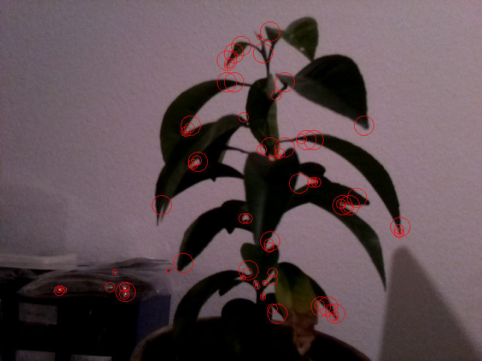
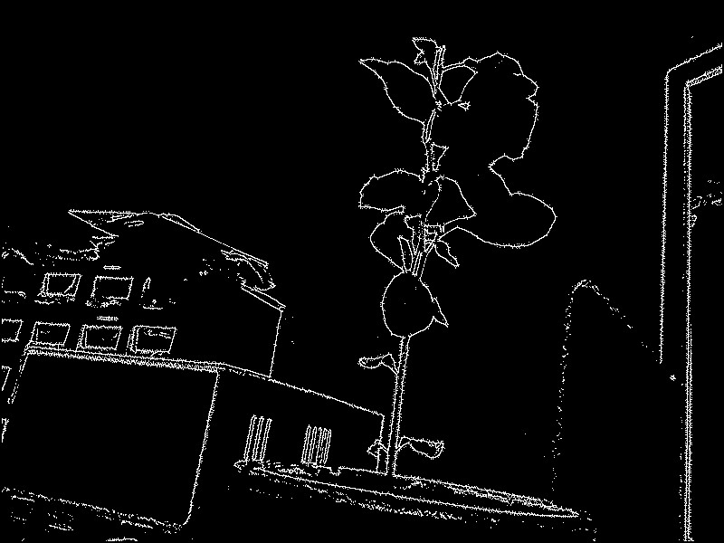

# Raspberry Pi Computer vision tools

Collection of low level computer vision tools on raspberry pi, mainly used as a learning tool for the algorithms, their optimisations on ARM arch with the goal to maybe implement them on FPGA one day.

They are using the raspberry pi and will display the result on the framebuffer, no need of window manager.

Tested on Raspberry pi 3 with the camera v2.1

Implemented algorithms:
- Sobel edge detection
- Canny edge detection
- Hough transform line detection
- Feature detection
- Optical flow

  