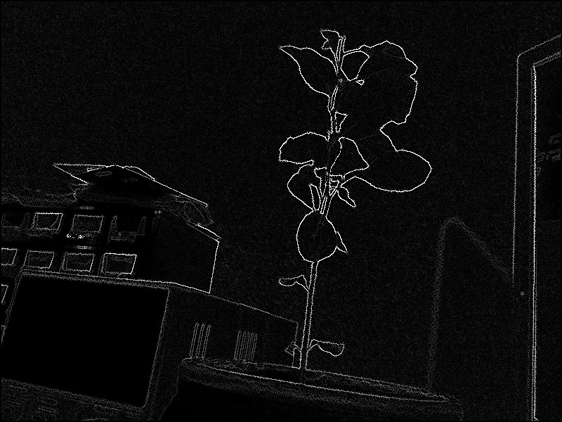

# Canny edge detection

Extend the sobel operator to implement the canny edge detection.
The main goal of canny is to thin and threshold the edges computer with the sobel operator.

Sobel operator:

Edge thinning:

Thresholding (with a low value):

