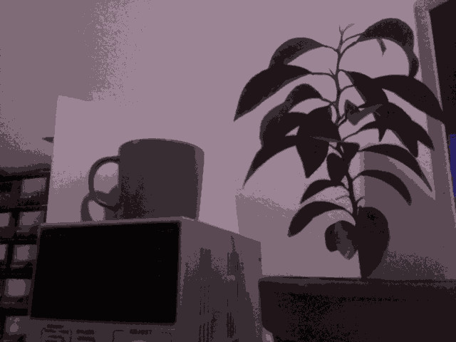
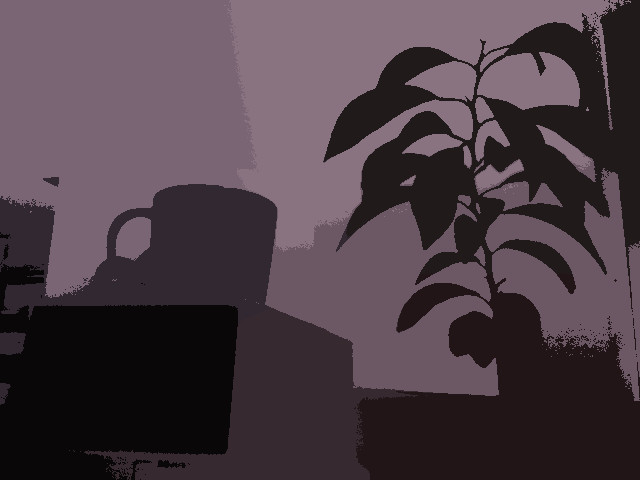

# Segmentation using kmeans

Segmentation of images using K-means algorithm
The algorithm will try to find centroids in the space of points representing the pixels. The points can contain the `rgb` value of pixels. The position of the pixels `xy` can also be added to the points to improve the localisation of the clusters.\
For each image the centroids will improve their clustering and their position will be kept between images, since it shouldn't significantly change.

Here is the result of a 8-means segementation only on the rgb space

By adding the x,y components in the kmeans we can better localize the clusters
For example the plant is shown as two similar clusters instead of lots of disjoints ones

